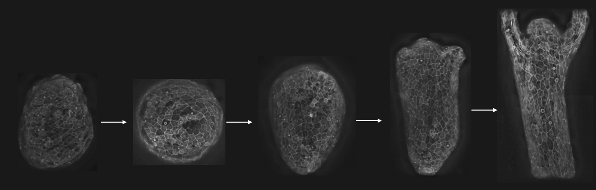
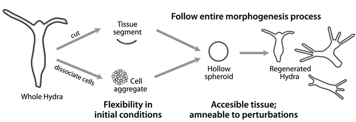
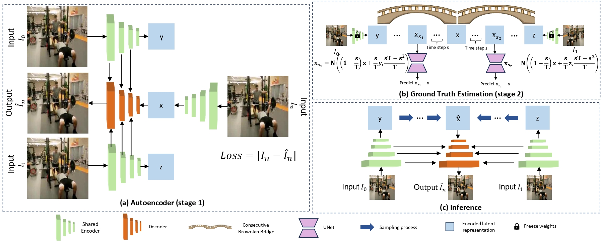

# Video Frame Interpolation of Hydra Regeneration



## Authors

Barak Aharoni & Itay Erlich

## Table of Contents

1. [Introduction](#introduction)
   - [Hydra Regeneration](#hydra-regeneration)
   - [Video Frame Interpolation](#video-frame-interpolation)
2. [Method](#method)
   - [Model](#model)
   - [Fine Tuning the Model for Hydra Regeneration](#fine-tuning-the-model-for-hydra-regeneration)
   - [Dataset](#dataset)
   - [Preprocessing](#preprocessing)
3. [Training](#training)
   - [Infrastructure](#infrastructure)
   - [Training the Autoencoder](#training-the-autoencoder)
   - [Training the Consecutive Brownian Bridge Diffusion Module](#training-the-consecutive-brownian-bridge-diffusion-module)
4. [Results](#results)
   - [Great Success](#great-success)
   - [Place for Improvement](#place-for-improvement)
5. [Command-Line Usage](#command-line-usage)
6. [Future Work](#future-work)
7. [Ethics Statement](#ethics-statement)
8. [Links](#links)
9. [Additional Model Information](#additional-model-information)
10. [Citation](#citation)

## Introduction

### Hydra Regeneration

In Kinneret Keren's lab at the Technion Physics Department, morphogenesis is studied using Hydra for its simple structure and regeneration ability. The Hydra is a small, freshwater organism from the phylum Cnidaria. The process involves:

1. Cutting a part of the Hydra.
2. The part becoming a ball.
3. The ball regenerates into a fully functional Hydra.



### Video Frame Interpolation

Video frame interpolation generates intermediate frames between consecutive frames in a video, useful for higher frame rates, slow motion, and video stabilization. The project aims to improve observation and analysis of Hydra regeneration.

## Method

### Model

We used the Frame Interpolation with Consecutive Brownian Bridge Diffusion model, which introduces a novel technique to improve video frame interpolation by reducing randomness. This approach is suitable for capturing the detailed changes in Hydra regeneration.



### Fine Tuning the Model for Hydra Regeneration

We fine-tuned a pre-trained model on Hydra regeneration videos, using additional augmentations like rotation due to the unique characteristics of these videos.

### Dataset
The dataset consists of various Hydra regeneration videos recorded in the lab, systematically collected for fine-tuning.
To make use of the Hydra_triplets dataset defined in [bvi_vimeo.py](./LDMVFI/ldm/data/bvi_vimeo.py), the dataset is expected to be in the following structure:
```
└──── <hydra data directory>/
    └──── video_name_1/
        ├──── frame_name_1.tiff
        ├──── frame_name_2.tiff
        ...
    ├──── video_name_2/
        ├──── frame_name_1.tiff
        ├──── frame_name_2.tiff
        ...
    ...
    ├──── tri_testlist.txt
    ├──── tri_trainlist.txt
    └──── tri_vallist.txt
```
where ```tri_{test, train, val}list.txt``` is a text file containing a triplets of consecutive frames.

#### Dataset Creation
To create the Dataset in


### Training the Autoencoder

The autoencoder identified unique Hydra features. [Training Loss Graph]

### Training the Consecutive Brownian Bridge Diffusion Module

Following autoencoder training, the diffusion module was trained to generate intermediate frames. [Training Loss Graph]

## Command-Line Usage

### Training LBBDM

To train the LBBDM model, use the following command (running from ConsecutiveBrownianBridge folder):
```bash
nohup python ./main.py --config ./configs/Template-LBBDM-video-hydra.yaml --train --save_top --gpu_ids 0,1 -r ./results_LBBDM > LBBDM_train_output.log 2>&1 &
Evaluating LBBDM
For model evaluation:

```bash

python ./ConsecutiveBrownianBridge/main.py --config ./ConsecutiveBrownianBridge/configs/Template-LBBDM-video.yaml --gpu_ids 0 -r ./results_LBBDM --resume_model path/to/model.pth --sample_to_eval
```

### Training LDMVFI AutoEncoder
To train the LDMVFI AutoEncoder, use the following command (running from LDMVFI folder):

```bash

nohup python main.py --base ./configs/autoencoder/vqflow-f32-small-hydra-dataset.yaml -r "/raid/home/itayerlich/DL_Project/LDMVFI/results_hydra_small_dataset/VQGAN/new_vimeo.ckpt" -t --gpus 0,1,2 > output_train_small_dataset.log 2>&1 &
```
### Video Frame Interpolation
To interpolate frames between two given frames using the trained model, use these commands:

```bash
python ./ConsecutiveBrownianBridge/interpolate.py --resume_model "/path/to/model/checkpoint" --frame0 "/path/to/frame0" --frame1 "/path/to/frame1" -r "/path/to/output" --xN 8 --config ./ConsecutiveBrownianBridge/configs/Template-LBBDM-video.yaml --gpu_ids 0,1,2
```

### Future Work
Future directions include advancing biophysical analysis by tracking regenerative cellular changes and enhancing the model with additional context from more frames.

### Ethics Statement
While the project has great potential, it is crucial to acknowledge that generated frames cannot replace real data. Users must be aware of this limitation to prevent misleading outcomes.

### Links
Presentation Video: [link]
GitHub Repository: [link]